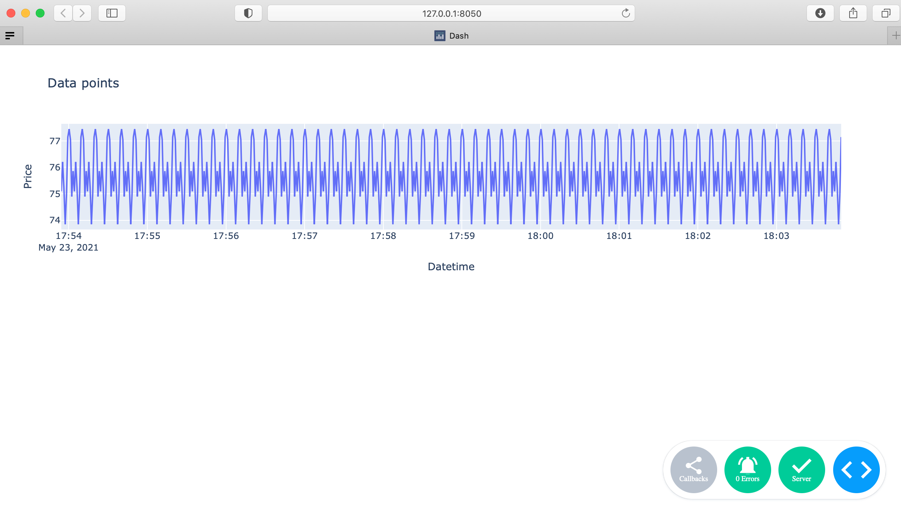

# Working example of influxdb with dash

## How to build and launch
Go to project root folder and issue following commands:
```bash
docker compose build
```
```bash
docker compose up
```

## How to connect:
Once containers are built and ran, point your browser to:
http://127.0.0.1:8050
_(or use hostname of server where you have run services)_

You will see updating chart with new data appearing every 10 seconds.

